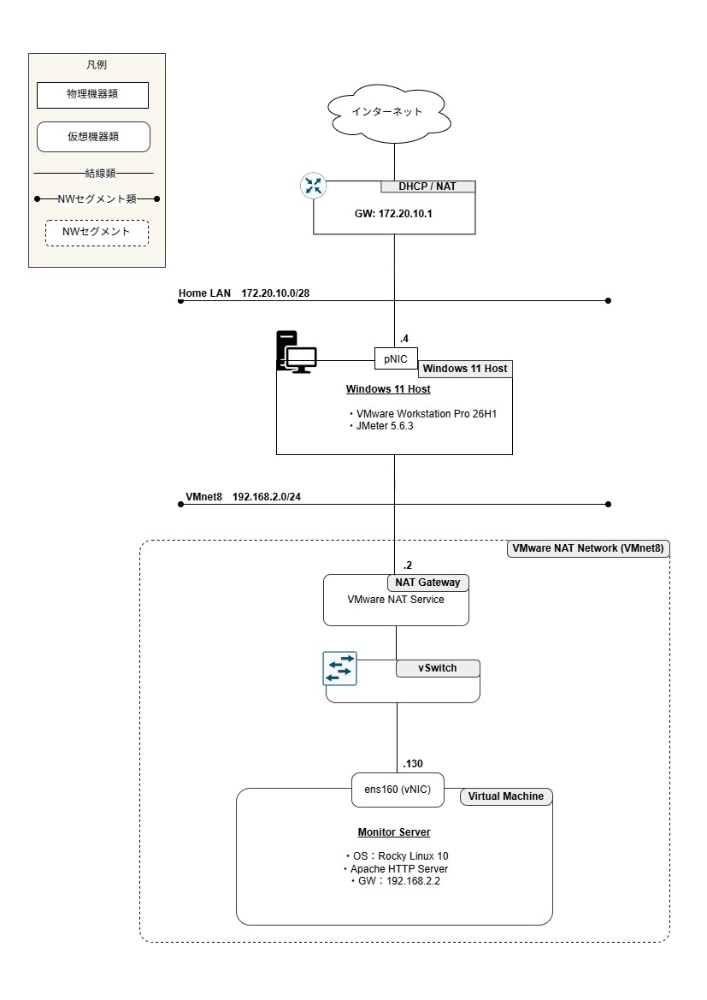
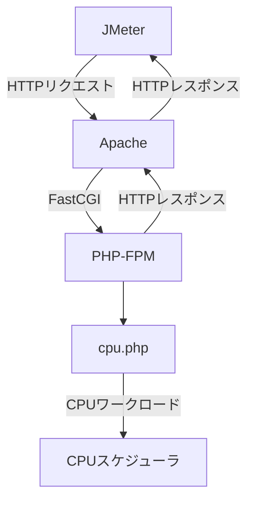
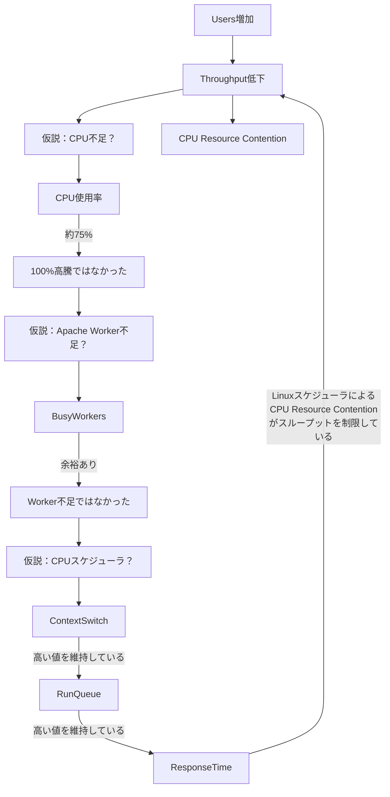

-------------------------------------------------------------------
Apache＋JMeter＋自作リソースログ収集スクリプトを用いて、CPU使用率、Apache Worker数、Linuxスケジューラの観点から検証し、調査結果を本記事にまとめてみました。
<!--more-->
-------------------------------------------------------------------

本検証用のログ収集スクリプト、phpスクリプト、グラフや実際の集計データなどは、個人Githubをご参照ください。


  


先に今回の検証結果をお伝えすると、CPU使用率だけではなく、
LinuxスケジューラによるCPU Resource Contentionも、Throughputを制限する要因であることが確認できました。
それでは、実際の検証内容と測定結果について説明していきます。

## 1. はじめに
Webサーバの性能を評価する際は、CPU使用率だけを見て、「CPUがボトルネック」と判断してしまうケースがあります。
しかし、本当にCPU使用率だけで性能限界を説明できるのかを判明したいので、
今回はJMeterと自作リソースログ収集スクリプトを用いて、
Apache HTTPサーバの性能限界を調査しました。

## 2. 検証目的
今回検証したいこと：

- CPU使用率とThroughputの関係
- Apache Worker数の変化
- Response Timeとの関係
- Linuxスケジューラの影響


## 3. システム構成
### 3.1. 構成図




### 3.2. 導入ソフトウェア
|項目|製品|
|---|---|
|ハイパーバイザー|VMware(R) Workstation Pro 26H1|
|OS|Rocky Linux 10.1|
|HTTPサーバ|Apache 2.4.63|
|ロードツール|JMeter 5.6.3|
|PHP|php-fpm 8.3.31|

## 4. 負荷試験方法

JMeterを用いて仮想サーバ（ホスト名：MonitorServer）に対し、事前に作成した負荷試験用PHPスクリプトへHTTPリクエストを送信し、負荷試験を実施しました。

各試験では JMeter ThreadGroupの設定を固定し、Thread数（仮想ユーザ数）のみを段階的に増加させることで、システム負荷の変化がスループットやOSリソースに与える影響を観察しました。

負荷試験は合計25回実施しています。

### 4.1. JMeter設定
- 各試験で使用したThreadGroupの設定は以下の通りです。
|項目|設定値|
|---|---|
|Ramp-up Period|10秒|
|Loop Count|Infinite|
|Duration|180秒|

- メトリクス収集で使用したListenerのオブジェクトは以下の通りです。
|項目|使用オブジェクト|
|---|---|
|Listener|Aggregate Report|

また、試験ごとにThread数のみを変更し、それ以外のパラメータはすべて同一条件としました。

### 4.2. データ収集方法

負荷試験中は、JMeterと自作のデータ収集スクリプトを使用し、スループットやCPU使用率などの各種メトリクスを収集しました。また、システムが定常状態に入った後のデータだけを評価対象とするので、各試験では以下のルールでデータを集計しています。

- 集計対象外：試験開始から30秒間（ウォームアップ期間）
- 集計対象　：残り150秒間（測定期間）

測定期間中に集計したデータは平均値を計算し、各試験の代表値として使用しました。

### 4.3. 負荷試験用PHPスクリプト

ApacheとPHP-FPMに対して軽量なCPUワークロードを与えるため、以下のPHPスクリプトを使用しました。

```php {filename="/var/www/html/cpu.php"}
##平方根計算と加算処理を繰り返し実行することで、CPU負荷を発生させています

<?php

$sum = 0;

##処理時間は約8msとなるようにループ回数を調整(2500回)
for($i=0;$i<2500;$i++){
    $sum += sqrt($i);
}

echo "Done : $sum";

?>
```


上記スクリプトで1リクエスト当たりの処理時間は、約8msであることが確認できています↓
``` {filename="MonitorServer"}
[root@MonitorServer ~]# time curl http://localhost/cpu.php
 Done : 83308.126280442   ←1リクエストの処理結果
 real 0m0.008s            ←1リクエスト当たり実請求時間に約0.008秒(8ミリ秒)
 user 0m0.003s
 sys 0m0.003s
```


### 4.4.データフロー
今回負荷試験のデータフローは以下のイメージです。




## 5. 観測指標
以下3観点から観測したい指標を選定しました。
|観点|指標|収集手段|
|---|---|---|
|HTTP性能|Throughput、Average、Median、90%、95%、99%、Max、Error%|Aggregate Report出力|
|CPUリソース|CPU Avg、Run Queue、Context Switch|vmstat、mpstatコマンド(自作スクリプト利用)|
|Apache状態|BusyWorkers、IdleWorkers、Processes|server-status?auto機能(自作スクリプト利用)|

それぞれ指標の意味と観測する理由を説明していきます。
### 5.1.HTTP性能
|指標|説明|本検証で観測する理由|
|---|---|---|
|Average|平均応答時間(ms)|全体的な応答性能を把握するため|
|Median|応答時間中央値(ms)|平常時の実際の応答速度を把握するため|
|90%Line|90%タイル(90%の値はこの値以下)|利用者の大部分が体感する応答時間を評価するため|
|95%Line|90%タイル(95%の値はこの値以下)|高負荷時の性能劣化を確認するため|
|99%Line|90%タイル(99%の値はこの値以下)|ごく一部の遅延リクエスト（ロングテール）の発生を確認するため|
|Max|最大応答時間(ms)|最悪ケースの応答時間を把握するため|
|Error%|リクエストの失敗率|サーバが正常にリクエストを処理できているかを確認するため|
|Throughput|秒間リクエスト数|サーバ全体の処理能力を評価するため、本検証で最も重要な指標|

### 5.2.CPUリソース
|指標|説明|本検証で観測する理由|収集コマンド|備考|
|---|---|---|---|---|
|CPUAvg|PU使用率の平均値|サーバがCPU資源をどの程度使用しているかを把握し、Throughputとの相関を確認するため|mpstat|100-%idleの値を採取|
|ContextSwitch|CPUが実行対象プロセスを切り替えた回数|CPUスケジューラの負荷を評価し、CPUResourceContentionの発生状況を確認するため|vmstat|cs欄の値を採取|
|RunQueue|CPU実行待ち状態のプロセス数|CPU待ちが増加しているかを確認し、CPUResourceContentionを評価するため|vmstat|r欄の値を採取|

#### 5.2.1 vmstatデータ収集スクリプト

```shell {filename="vmstat_observe.sh"}
#!/bin/bash

printf "time,r,b,swpd,free,buff,cache,si,so,bi,bo,in,cs,us,sy,id,wa,st,gu\n"
while true
do
 printf "%s," "$(date '+%Y-%m-%d %H:%M:%S')" ; vmstat 1 2 | tail -1 | tr -s ' ' ',' | sed 's/^,//'
done
```




  - スクリプトを実施しcsvファイルにリダイレクト
``` 
./vmstat_observe.sh > vmstat_test.csv
```
  - 出力内容
```{filename="vmstat_test.csv"}
time,r,b,swpd,free,buff,cache,si,so,bi,bo,in,cs,us,sy,id,wa,st,gu
2026-08-02 01:12:38,0,0,0,7054760,5236,364876,0,0,0,0,304,192,0,0,100,0,0,0
2026-08-02 01:12:39,0,0,0,7054508,5236,364876,0,0,0,0,423,221,0,0,100,0,0,0
2026-08-02 01:12:40,0,0,0,7054188,5236,364876,0,0,0,0,391,238,0,0,100,0,0,0
2026-08-02 01:12:41,0,0,0,7054188,5236,364876,0,0,0,0,416,228,0,0,100,0,0,0
```


#### 5.2.2　mpstatデータ収集スクリプト

```shell {filename="mpstat_observe.sh"}
#!/bin/bash

printf "time,CPU,%%usr,%%nice,%%sys,%%iowait,%%irq,%%soft,%%steal,%%guest,%%gnice,%%idle\n"
while true
do
mpstat 1 1 | head -4 | tail -1 | tr -s ' ' ',' | sed 's/^,//'
done
```




  - スクリプトを実施しcsvファイルにリダイレクト
```
./mpstat_observe.sh > mpstat_test.csv
```
  - 出力内容
``` {filename="mpstat_test.csv"}
time,CPU,%usr,%nice,%sys,%iowait,%irq,%soft,%steal,%guest,%gnice,%idle
01時15分37秒,all,0.00,0.00,0.00,0.00,0.25,0.00,0.00,0.00,0.00,99.75
01時15分38秒,all,0.00,0.00,0.00,0.00,0.13,0.00,0.00,0.00,0.00,99.87
01時15分39秒,all,0.00,0.00,0.00,0.00,0.19,0.00,0.00,0.00,0.00,99.81
01時15分40秒,all,0.00,0.00,0.06,0.00,0.19,0.06,0.00,0.00,0.00,99.69
```


### 5.3.Apache状態
|指標|説明|本検証で観測する理由|
|---|---|---|
|BusyWorkersAvg|リクエスト処理中のApacheWorker数の平均値|Worker不足がボトルネックとなっているかを確認するため|
|IdleWorkersAvg|待機中のApacheWorker数の平均値|Workerに余裕が残っているかを確認するため|
|ProcessesAvg|Apacheプロセス数の平均値|MPMEventが必要に応じてプロセスを増減させているかを確認するため|
#### 5.3.1.Apache server-statusデータ収集スクリプト

  Apacheの状態監視には、Apache標準モジュールmod_statusが提供するserver-statusを利用しました。本検証では、以下のコマンドを一定間隔で実行し、Apache内部の状態を収集しました。
```bash
curl -s localhost/server-status?auto
```
【参考元】[Apacheのserver-statusでリソース監視](https://performance.oreda.net/middleware/web/server-status "Apacheのserver-statusでリソース監視")



```shell {filename="apache_observe.sh"}
#!/bin/bash

printf "time,BusyWorkers,IdleWorkers,Processes\n"
while true
do
  printf "%s," "$(date '+%Y-%m-%d %H:%M:%S')"
  curl -s localhost/server-status?auto\
       | awk '/BusyWorkers/ { b=$2 }
              /IdleWorkers/ { i=$2 }
              /Processes/   { p=$2 }
              END {
              printf "%s,%s,%s\n",b,i,p
              }'
   sleep 1
done
```




  - スクリプトを実施しcsvファイルにリダイレクト
```
./apache_observe.sh > apache_test.csv
```
  - 出力内容
``` {filename="apache_test.csv"}
time,BusyWorkers,IdleWorkers,Processes
2026-08-02 01:51:53,1,74,3
2026-08-02 01:51:54,1,74,3
2026-08-02 01:51:55,1,74,3
2026-08-02 01:51:56,1,74,3
2026-08-02 01:51:57,1,74,3
2026-08-02 01:51:58,1,74,3
2026-08-02 01:51:59,1,74,3
2026-08-02 01:52:00,1,74,3
```



## 6. 測定結果

測定したデータを集計し、下記のテーブルにまとめました。

|テストNo.|Users|CPU Avg|Average|Median|90% Line|95% Line|99% Line|Max|Error%|Throughput|BusyWorkers Avg|IdleWorkers Avg|Processes Avg|Context Switch|Run Queue|
|---|---|---|---|---|---|---|---|---|---|---|---|---|---|---|---|
|#1|5|18.58%|0|1|2|2|3|16|0.00%|4714.02|3.31|96.69|4.00|47304.27|3.18|
|#2|10|32.70%|1|1|2|2|2|24|0.00%|9034.29|5.83|94.17|4.00|86387.39|6.63|
|#3|15|42.77%|1|1|2|2|3|44|0.00%|10927.35|7.99|92.01|4.00|100430.94|10.78|
|#4|20|48.00%|1|2|2|3|4|75|0.00%|11226.24|9.81|90.19|4.00|93014.92|12.15|
|#5|25|52.27%|1|2|3|3|5|54|0.00%|12068.60|10.90|89.10|4.00|98178.16|17.93|
|#6|30|55.71%|2|2|3|4|6|78|0.00%|12503.02|12.83|104.42|5.00|94855.75|21.03|
|#7|40|61.63%|2|3|4|5|7|64|0.00%|13862.91|14.26|110.74|5.00|100996.88|30.86|
|#8|50|65.32%|3|3|5|6|9|78|0.00%|13787.29|17.10|107.90|5.00|104172.27|35.14|
|#9|60|68.58%|3|3|6|7|10|142|0.00%|15069.72|20.65|110.06|5.23|108101.20|37.11|
|#10|70|67.00%|5|5|8|9|15|103|0.00%|12685.72|23.33|126.67|6.00|83970.42|37.79|
|#11|80|69.61%|5|5|8|10|16|232|0.01%|13811.82|24.94|138.58|6.54|97665.70|40.94|
|#12|100|70.00%|7|7|11|14|24|100|0.02%|12709.22|28.87|146.13|7.00|82559.53|48.14|
|#13|120|72.18%|8|7|12|15|25|124|0.05%|13926.25|28.39|146.61|7.00|87065.47|48.83|
|#14|150|72.42%|10|9|15|18|32|169|0.10%|13882.26|35.01|178.80|8.55|86497.71|46.61|
|#15|200|74.09%|13|13|19|24|41|181|0.21%|13892.22|43.53|202.92|9.86|86053.27|62.80|
|#16|250|74.79%|16|15|22|27|44|180|0.63%|14624.50|47.46|207.71|10.25|84443.57|61.65|
|#17|300|75.15%|19|18|28|35|53|1053|2.65%|14420.30|45.60|210.56|10.30|91732.42|56.50|
|#18|350|73.43%|24|22|39|47|68|1110|5.68%|13614.52|38.46|214.29|10.14|82913.90|57.92|
|#19|400|72.25%|28|25|47|56|78|1087|8.29%|13496.65|40.23|216.81|10.39|80243.38|59.48|
|#20|500|70.62%|38|33|68|83|114|71288|13.62%|9414.63|45.78|220.07|10.81|79306.95|59.50|
|#21|600|66.40%|50|40|91|109|154|5137|17.85%|11327.93|50.36|209.45|10.56|74377.79|56.63|
|#22|700|65.24%|64|49|111|131|308|197099|21.53%|8761.66|64.56|211.47|11.28|67753.13|54.81|
|#23|800|64.75%|74|52|119|147|808|8074|21.86%|10338.35|64.38|229.87|12.06|67318.66|46.93|
|#24|900|65.23%|83|54|130|169|1095|5841|22.37%|10297.71|72.31|226.01|12.31|72455.16|58.98|
|#25|1000|65.22%|97|58|144|227|1128|159366|23.20%|9337.35|72.65|234.34|12.63|69573.91|57.33|


集計した数値だけだと、評価するのが少し難しいので、Excelで可視化しました。次の6つのグラフにしました。

#### 6.1.Users vs Throughput



■ 観察結果

負荷を徐々に増加させると、Throughputもそれに伴って増加し、
約250～300Users付近で約14,600 Requests/secに到達しました。
しかし、それ以降はUsersをさらに増加させてもThroughputは伸びず、
350 Users以降では逆に低下する傾向が確認できました。

つまり、本環境では「ユーザ数を増やせばスループットも比例して増える」わけではないということが分かります。

■ 疑問

それでは、なぜThroughputは約300 Users付近で頭打ちになったのでしょうか？
一番考えやすい要因は、

  - CPU使用率が上限に達した
  - Apache Worker数が不足した
  - OS側で別のボトルネックが発生した

などが考えられます。

なので次はCPU使用率との関係を確認します。



#### 6.2.Users vs CPU Utilization



■ 観察結果

CPU使用率はUsersの増加に伴って上昇し、約300 Users付近では約75%に達しています。
しかし興味深いことに、その後Usersをさらに増やしてもCPU使用率は増えず、むしろ65%前後まで低下しています。

■ 考察

もしCPU性能そのものが限界であれば、CPU使用率は100%近くまで上昇すると予想されます。
しかし今回の結果では、CPUはまだ余力を残した状態でありながら、Throughputだけが低下しています。

つまり、CPU使用率だけでは今回のボトルネックを説明できません。

■ 疑問
ではApache Workerが不足していたのでしょうか？

なので次にApache Worker数を確認します。



#### 6.3.Users vs Aapche Workers



■ 観察結果

ユーザ数の増加に伴い、BusyWorkersは徐々に増加しています。
一方で、Throughputが低下し始める350Users以降でも、BusyWorkersはまだ増加していることが確認できました。

■ 考察

Apacheは負荷増加に応じてWorkerを割り当て続けていまうｓ。つまり、Worker数が不足して処理できなくなったわけではありませんでした。
少なくとも今回の検証では、Apache Worker数がボトルネックになっているとは考えにくいと思います。

■ 疑問

では、Apache Workerが処理を続けているにもかかわらず、なぜThroughputは増えなくなったのでしょうか？

次にLinuxカーネル側のCPUスケジューリング状況を確認する。



#### 6.4.Users vs Context Switch



■ 観察結果

Context Switch数は、ユーザ数の増加に伴って増加しています。
特にCPU使用率が約70%付近に達した以降も、Context Switchは高い値を維持しています。

■ 考察

Context Switchとは、CPUが実行するスレッドを切り替える回数であるため、
ユーザ数の増加により、CPUは多数のPHP処理を順番に切り替えながら実行していることが分かります。

CPU自身の計算能力よりも、スレッド切替えのオーバーヘッドが増えている可能性がある。

■ 疑問

しかし、Context Switchだけでは、CPU待ちが本当に発生しているかは判断できるのは難しいと思います。

なので、次にRun Queueを確認する。



#### 6.5.Users vs Run Queue



■ 観察結果

Run Queueは、ユーザ数の増加に伴い増加しています。
特にThroughputが頭打ちになる付近では、Run Queueも高い値を維持しています。

■ 考察

Run Queueは、CPU実行待ちスレッド数を表すので、つまり、CPUで実行したい処理が増え、すぐに実行できず待ち行列が発生していることが分かります。

CPU使用率はまだ100%ではないのに、CPUスケジューラによる待ち時間が増加しています。
⇒**Throughputを制限している要因は、CPU使用率そのものではなく、CPU Resource Contentionであると考えられます。**

■ 疑問

CPU待ちは確認できました。では、利用者から見えるResponse Timeには、どのような影響が出ているのでしょうか？



#### 6.6.Users vs Response Time



■ 観察結果

スループットが頭打ちになる付近から、Average Response Timeも急激に増加しています。同時に95%、99% Lineも大きく増加しています。

■ 考察

CPU待ち時間が増えることで、PHP処理開始までの待ち時間が長くなり、Response Timeが悪化したと考えられます。
この結果、スループットは増えず、一方でResponse Timeだけが悪化しています。



## 7. 結論

6.1.～6.6.の観察結果と考察から、以下の結論が得られました。

- CPU使用率だけでは性能限界を説明できなかった。
- Apache Worker数も限界ではなかった。
- Context Switchだけでは、CPU待ちが本当に発生しているかは判断できない
- LinuxスケジューラによるCPU Resource ContentionがThroughputを制限していたと考えられる。

これまでの検証流れを検証フロー図に描いてみました。






**本検証では、Apache Worker不足が原因ではなく、Linux スケジューラによるCPU Resource Contentionが、スループット低下およびResponse Time悪化の主要因であることが確認できました。**